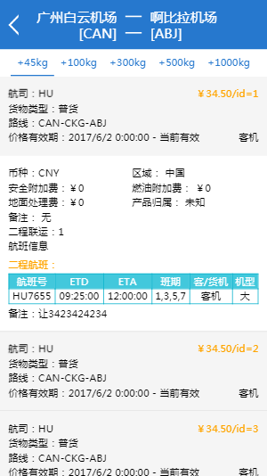
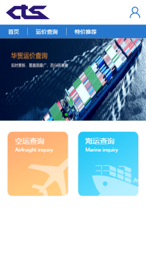
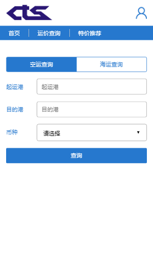
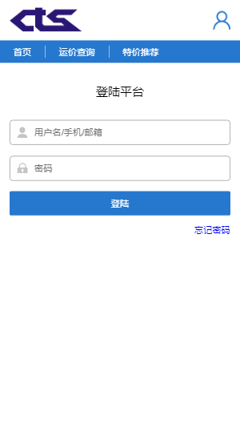
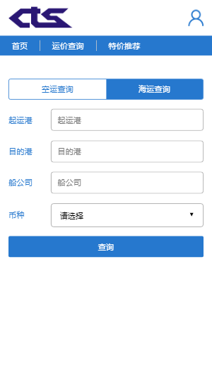
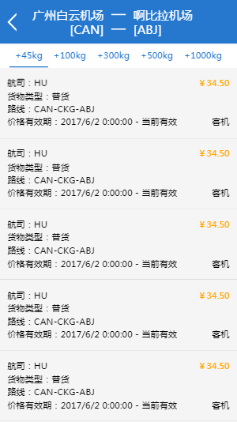

## 华贸公众号微信端物流信息查询

## 技术栈

<p> gulp + sass + jquery weui + tempate7.js </p>

## 运行项目

``` bash
# install dependencies
npm install

# serve with hot reload at localhost:8080
gulp

# build and public
gulp build

```

<h3>新增文件或者没有效果可以尝试重新运行gulp命令</h3>

## 部分截图
<p>
  
  
  
  
  
  
</p>